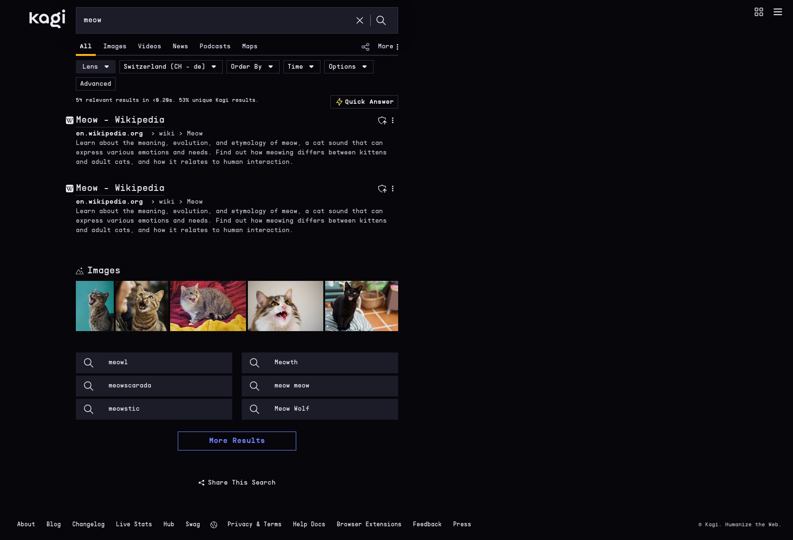

# Sine qua non for [Kagi Search](https://kagi.com/).

## Usage

Simply copy the contents of [kagi.css](https://github.com/snqn/kagi.css/blob/main/kagi.css) to your Kagi Appearance custom CSS settings:

1. go to [Kagi's custom CSS](https://kagi.com/settings/custom_css) settings
2. paste the file contents
3. enjoy

## Thanks to

### Contributors

- [74k1](https://github.com/74k1)

---

Copyright © 2026-present SNQN
